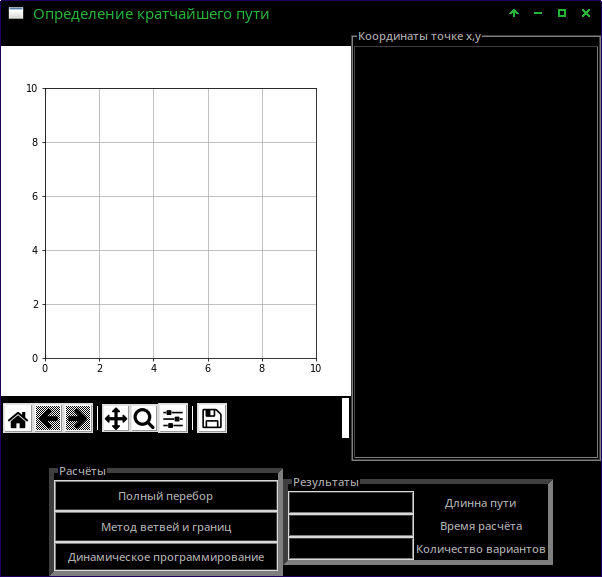
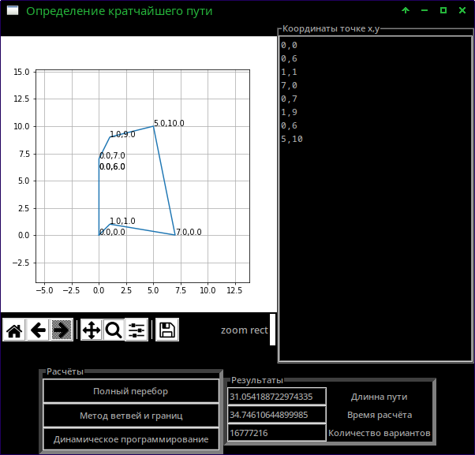
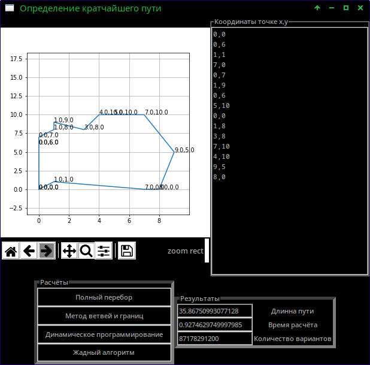
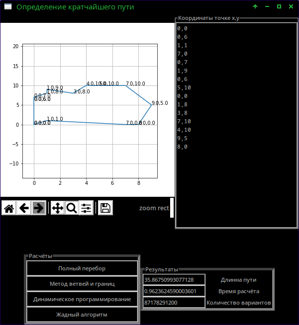
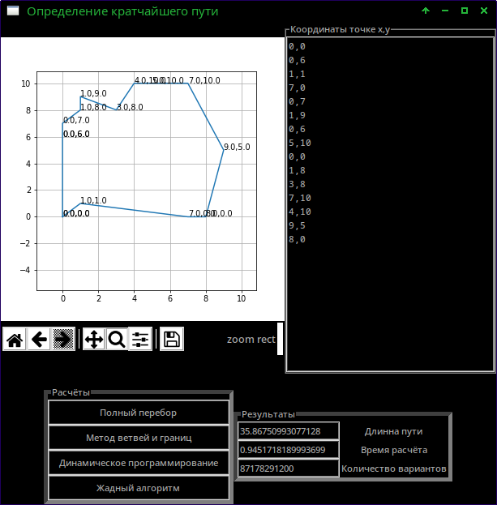

# Задача коммивояжёра

Разработка и экспериментальное исследование точных методов и алгоритмов оптимизации (на примере задачи коммивояжёра).

## Интерфейса для ввода информации и визуализации результатов решения задач.

В интерфейсе есть область для вывода графика с элементами управления (*возврат графика к изначальным координатам, предыдущее действие, следующее действие, движение по графику, масштабирование, настройки графика, сохранение графика в файл*). Рядом с графиком расположена область для ввода координат. Координаты вводятся столбцом сверху в них. X и Y разделены запятой. Координаты с плавающей точкой следует вводить через запятую.

## Метод прямого исчерпывающего перебора вариантов

Был разработан алгоритм для перебора всех возможных способов решения задачи. Итоговый алгоритм содержит несколько допущений:

1. Количество посещённых «городов» равно количеству «городов».
2. «Города» должны быть посещены хотя бы один раз.

Алгоритм работает следующим образом:

1. Генерируются всевозможные комбинации посещений городов.
2. Отбрасываются варианты не соответствующие вышеописанному допущению.
3. Для всех остальных вариантов считается длинна пути.
4. Выбирается вариант с наименьшей длинной.

## Метод ветвей и границ

Алгоритм позаимствован из этого [репозитория](https://github.com/Clever-Shadow/python-salesman)

Итоговая программа работала по следующему алгоритму:

1. В каждой строке матрицы находится минимальный элемент и вычитается из всех остальных элементов строки. Также это было сделано и для столбцов. Таким образом получается матрица стоимости, каждая строка и каждый столбец которой содержат хотя бы один нулевой элемент.
2. Для каждого нулевого элемента матрицы рассчитается коэффициент, который равен сумме наименьшего элемента строки и наименьшего элемента столбца. Из всех коэффициентов выбирается такой, который является максимальным. 
3. Удаляется строка и столбец, элементы получают значение бесконечности. 
4. Алгоритм повторяется до получения контура.

## Метод динамического программирования

Алгоритм взят из данной [статьи](https://gist.github.com/mlalevic/6222750)

Алгоритм динамического программирования строится на том, что минимальный путь между пятью городами, это минимальный путь между четырёх городов плюс расстояние до пятого. Таким образом расстояние задачу коммивояжёр  можно разбить на множество подзадач, которые разбиваются на подзадачи.

##  Разработка жадного алгоритма и программы решения задач дискретной оптимизации

Алгоритм взят из данной [статьи](https://habr.com/ru/post/329604/)

Особенность жадного алгоритма состоит в то, что при построении маршрута, он всегда выбирает между городами самый короткий путь.

